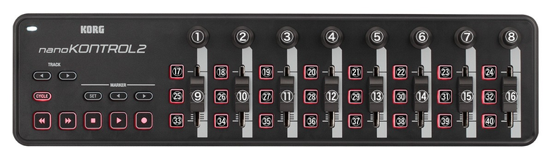

# TB-3 Editor for midiglue

## 目次
- [概要](##概要)
- [準備](##準備)
- [操作方法](##操作方法)

-----

## 概要
TB-3 Editor for midiglueを使用することにより、nanoKONTROL2からmidiglueを経由してTB-3の隠しパラメータを操作することができます。
  

## 準備

- TB-3 Editor for midiglueのインストール
  - 以下のファイルを 書類/midiglue フォルダまたはそのサブフォルダにコピーしてください。
    - TB3Edit_10.flow
    - tb3_303.node
    - tb3Distortion.node
    - tb3Efx1.node
    - tb3Efx2.node
    - tb3Sytn.node
    - knob_s.node
    - route_max.node
  - midiglueとPCをUSBケーブルで接続し、midiglueの電源をONにしてください。
  - midiglueEditorを起動して[Open File...]メニューから `TB3Edit_10.flow` を開いてください。
  - 左上のボタンをクリックすると、ビルドと転送が行われます。
  - 転送が完了するとmidiglueが再起動します。再起動完了後にTB-3 Editor for midiglueを使用することができます。

 

- nanoKONTROL2の設定
  - [`KORG KONTROL Editor`](https://www.korg.com/jp/support/download/product/0/159/#software)を用いて、`setting for TB-3 Editor_v0.1.nktrl2_data` をnanoKONTROL2に転送してください。

 

- 接続
  - nanoKONTROL2 : midiglueのHost端子にUSBケーブルで接続してください。
  - TB-3 : midiglueのMIDI OUT1またはMIDI OUT2とTB-3のMIDI INをMIDIケーブルで接続してください。

  

## 操作方法
### midiglue側操作

| 操作子 | Parameter Name | Value | Description |
| --- | --- | --- | --- |
|  L-ノブ | MODE | SYNTH /  DISTORTION /  EFX1 /  EFX2 /  TB-303| SYNTH MODE: シンセ部のパラメータを設定するモード DISTROTION MODE: ディストーションのパラメータを設定するモード EFX1 MODE: EFX1の設定をするモード EFX2 MODE: EFX2の設定をするモード TB-303 MODE : TB-303のノブと同じ並びで操作できるモード|
|  B-ボタン |  |  | Bボタンを押しながらnanoKONTROLを操作すると、対応したパラメータ名が 画面に表示されます。TB-3にデータは送信されません。 nanoKONTROL2の操作子に対応したパラメータを確認する際に使用してください。 |
 

### nanoKONTROL2側操作

  
#### SYNTH MODE
| No. | Parameter Name | Value | Description |
| --- | --- | --- | --- |
|  1 | CUTOFF | 0 - 127 | フィルターのカットオフ周波数を設定する |
|  2 | RESONANCE | 0 - 127 | フィルターのレゾナンスを設定する |
|  3 | ENV MOD | 0 - 127 | カットオフ周波数にエンべーロープをかける強さを設定する |
|  4 | ACCENT | 0 - 127 | アクセントの強さを設定する |
|  5 | VCF / VCA ATTACK | 0 - 127 | エンベロープのアタックを設定する |
|  6 | VCF / VCA DECAY | 0 - 127 | エンベロープのディケイを設定する |
|  7 | VCF / VCA SUSTAIN | 0 - 127 | エンベロープのサスティンを設定する |
|  8 | VCF / VCA RELEASE | 0 - 127 | エンベロープのリリースを設定する |
|  9 | SAW LEVEL / TUNE | 0 - 127 | ノコギリ波のLEVELまたはTUNEを設定する |
| 10 | SQR LEVEL / TUNE | 0 - 127 | 矩形はのLEVELまたはTUNEを設定する |
| 11 | SIN LEVEL | 0 - 127 | 正弦波のLEVELを設定する |
| 12 | NOISE LEVEL | 0 - 127 | ノイズのLEVELを設定する |
| 13 | CROSS MOD | -63 - 64 | クロスモジュレーションの強さを設定する |
| 14 | GATE TIME | -63 - 64 | シーケンサのゲートタイムを設定する |
| 15 | LFO RATE | 0 - 127 | LFOの周波数を設定する |
| 16 | LFO DEPTH | -63 - 64 | LFOの深さを設定する |
| 17 | SAW SW | OFF / ON | SAW オシレータの OFF/ON を切り替える |
| 18 | SQR SW | OFF / ON | SQR オシレータの OFF/ON を切り替える |
| 19 | SIN SW | OFF / ON | SIN オシレータの OFF/ON を切り替える |
| 20 | NOISE SW | OFF / ON | NOISE オシレータの OFF/ON を切り替える |
| 21 | ENV MODE | VCF / VCA | VCF の場合 : 5~8ノブでVCFのエンベロープを設定する VCA の場合 : 5~8ノブでVCAのエンベロープを設定する |
| 22 | - | - | - |
| 23 | LFO WAVE | SAW / SQR / TRI / SIN / S&H | LFOの波形を設定する |
| 24 | LFO DEST | OFF / PITCH / CUTOFF / VOLUME | LFOをかける先のパラメータを設定する |
| 25 | SAW TUNE RESET | - | SAWオシレータのTUNEをリセットします |
| 26 | SQR TUNE RESET | - | SQRオシレータのTUNEをリセットします |
| 27 | - | - | - |
| 28 | - | - | - |
| 29 | CROSS MOD RESET | - | クロスモジュレーションの強さをリセットします |
| 30 | GATE TIME RESET | - | ゲートタイムの長さをリセットします |
| 31 | - | - | - |
| 32 | LFO DEPTH RESET | - | LFOの深さをリセットします |
| 33 | OSC SETTING MODE | LEVEL / TUNE | OSC設定のモードをLEVEL/TUNEの間で切り替える |
| 34 | - | - | - |
| 35 | - | - | - |
| 36 | - | - | - |
| 37 | - | - | - |
| 38 | - | - | - |
| 39 | LFO RETRIGGER | OFF / ON | OFF : KEY ON時にLFOの位相をリセットしない ON : KEY ON時にLFOの位相をリセットする |
| 40 | LFO BPM SYNC | OFF / ON |  OFF : LFO RATEをBPMに同期しない OFF : LFO RATEをBPMに同期する |
  
#### DISTORTION MODE

| No. | Parameter Name | Value | Description |
| --- | --- | --- | --- |
|  1 | TYPE | Mid Boost, Clean Boost, Treble Bst,Blues OD, Crunch, Natural OD, OD-1, T-Scream, Turbo OD, Warm OD, Distortion, Mild DS, Mid DS, RAT, GUV DS, DST+, Modern DS, Solid DS, Stack, Loud, Metal Zone, Lead, '60s FUZZ, Oct FUZZ, MUFF FUZZ | ディストーションのタイプを設定する |
|  2 | DRIVE | 0 - 12 | DRIVEを設定する |
|  3 | BOTTOM | 0 - 100 | BOTTOMを設定する |
|  4 | TONE | 0 - 100 | TONEを設定する |
|  5 | DRY/WET | 0 - 100 | ドライ音とエフェクト音のバランスを設定する(0 : ドライ音のみ、100 : エフェクト音のみ) |
|  17 | DISTORTION SW | OFF / ON | ディストーションのOFF/ONを切り替える |
  
#### EFX1 MODE

| No. | COMPRESSOR | RING MOD | BIT CRUSHER | TREMOLO | CHORUS | FLANGER | PHASER |
|---|---|---|---|---|---|---|---|
| 1 | CS:ATTACK | RM:FREQUENCY | BC:FILTER | TR:TYPE | CH:MODE | FL:RATE | PH:TYPE |
| 2 | CS:RELEASE | RM:SENS | BC:SAMPLE RATE | TR:PHASE | CH:RATE | FL:BPM SYNC | PH:RATE |
| 3 | CS:THRESHOLD | RM:POLARITY | BC:EQ LOW | TR:RATE | CH:BPM SYNC | FL:DEPTH | PH:BPM SYNC |
| 4 | CS:RATIO | RM:EQ LOW | BC:EQ HIGH | TR:BPM SYNC | CH:DEPTH | FL:MANUAL | PH:DEPTH |
| 5 | CS:KNEE | RM:EQ HIGH | - | TR:SHAPE | CH:PRE DELAY | FL:RESONANCE | PH:MANUAL |
| 6 | CS:GAIN | - | - | TR:DEPTH | CH:HPF | FL:SEPARATION | PH:RESONANCE |
| 7 | - | - | - | TR:PAN SELECT | CH:LPF | FL:HPF | PH:STEP RATE |
| 8 | CS:DRY/WET | RM:DRY/WET | BC:LEVEL | TR:LEVEL | CH:LEVEL | FL:DRY/WET | PH:DRY/WET |
| 9 | EFX1 TYPE | <- | <- | <- | <- | <- | <- |
| 17| CS:SW | RM:SW | BC:SW | TR:SW | CH:SW | FL:SW | PH:SW |
  
#### EFX2 MODE

| No. | COMPRESSOR | RING MOD | BIT CRUSHER |
|---|---|---|---|
| 1 | CS:ATTACK | DD:TYPE | RV:TYPE |
| 2 | CS:RELEASE | DD:TIME | RV:TIME |
| 3 | CS:THRESHOLD | DD:TAP TIME | RV:PRE DELAY |
| 4 | CS:RATIO | DD:BPM SYNC | RV:HPF |
| 5 | CS:KNEE | DD:FEEDBACK | RV:LPF |
| 6 | CS:GAIN | DD:LPF | RV:DENSITY |
| 7 | - | - | RV:SPRING SENSE |
| 8 | CS:DRY/WET | DD:LEVEL | RV:LEVEL |
| 9 | EFX1 TYPE | <- | <- |
| 17| CS:SW | DD:SW | RV:SW |
  
#### TB-303 MODE

| No. | PARAMETER |
|---|---|
| 1 | TUNE |
| 2 | CUTOFF |
| 3 | RESO |
| 4 | ENV MOD |
| 5 | DECAY |
| 6 | ACCENT |
| 17 | WAVEFORM |
  
